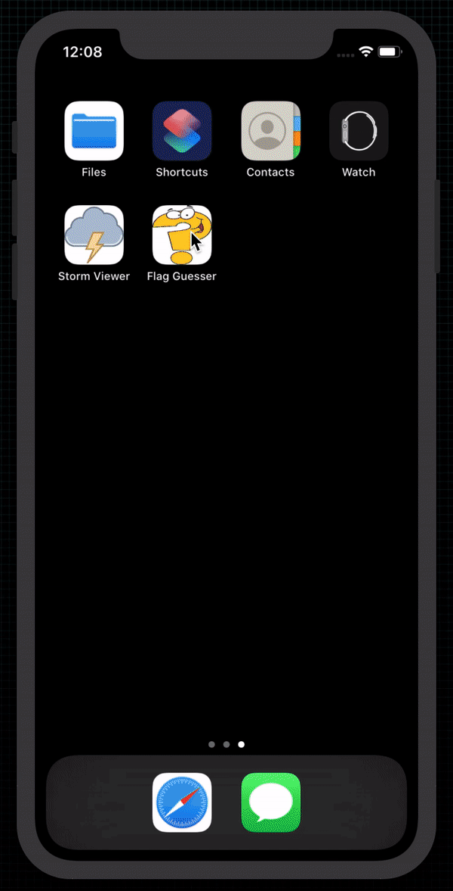

# Flag Guesser

  

 
Game that shows some random flags to users; Asks them which one belongs to a country.

## Examples within this code

- Interface Builder
- Auto Layout
- IBOutlets
- IBActions
- @2x and @3x images
- Asset catalogs
- UIButton
- CALayer
- UIColor
- Random numbers
- UIImage
- UIAlertController
- UIBarButtonItem

## Demonstration
Small demonstration as to what the game does when on device.
 

